JG_Programming_IChing

This project is a portfolio piece for my data science resume. I used Python to create a digital IChing (an ancient Chinese divination method).

## Project Summary

The IChing, also known as, "The Book of Changes," is an ancient Chinese divination method that dates back to around 1000 - 750 BC. It consists of 64 "hexagrams," or combinations of yin or yang lines, stacked six high. Each of the 64 hexagrams has a particular meaning, which we'll get into later.

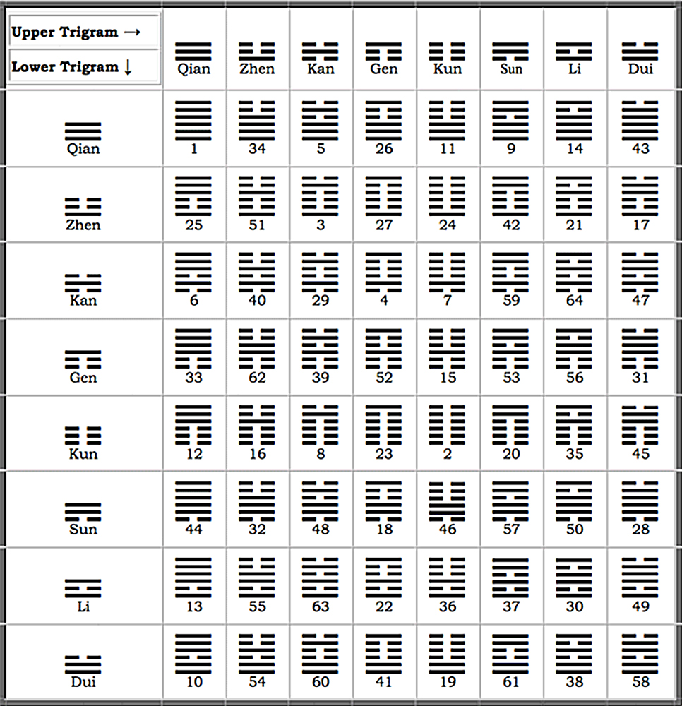

When using the IChing, people traditionally use three coins to cast a single line, which could be either yin or yang, changing or unchanging. Yang lines are unbroken, and yin lines have a gap in the center.

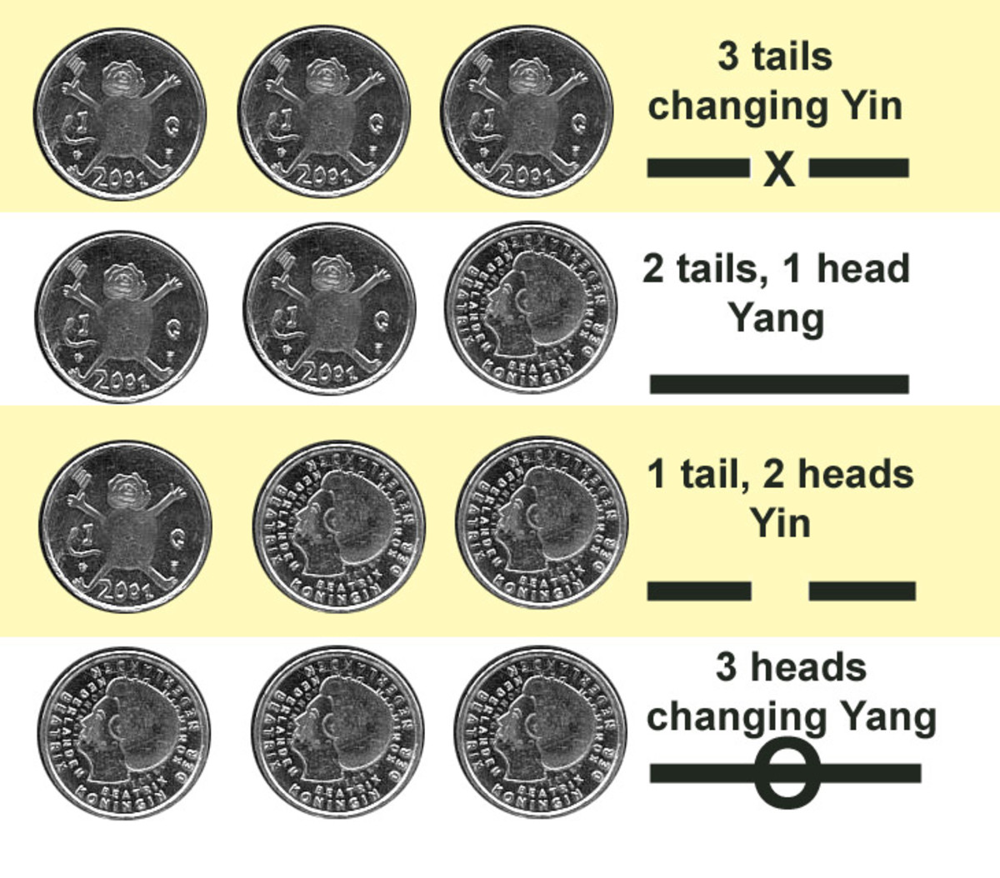

After casting three coins six times, recording each line from bottom to top, you now have a hexagram. Red lines signify changing lines, which determines what the changed hexagram will be. See how hexagram 1 turns into hexagram 24? The changing yang lines on the left turn into yin lines on the right.

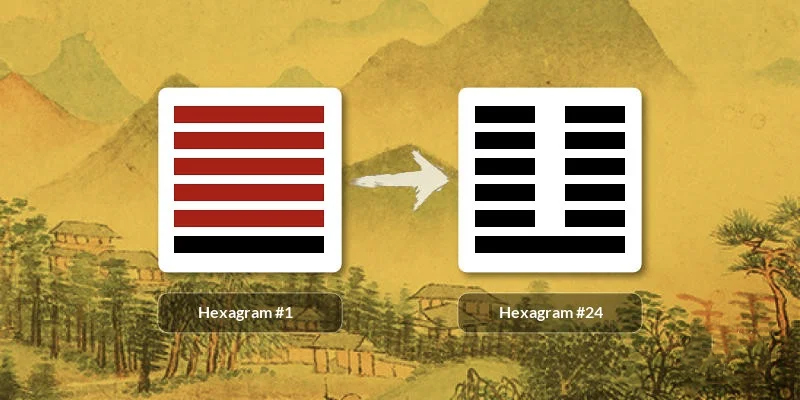

I made a spreadsheet for the hexagrams in order to pair hexagrams with their binary equivalent. "Zero" stands for yin and "One" stands for yang. Notice how each of the hexagrams has a unique 6 digit binary code.

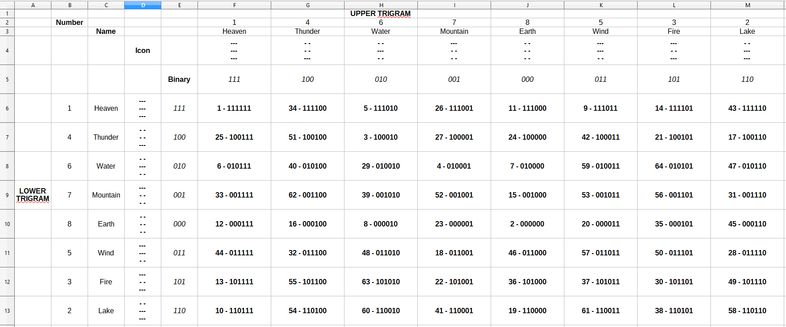

This next spreadsheet concatenates the 1-64 number with both the binary code and the single word that represents each hexagrams concept. See how "1" stands for "Creative" and has a binary code of "111111" or all yang lines?

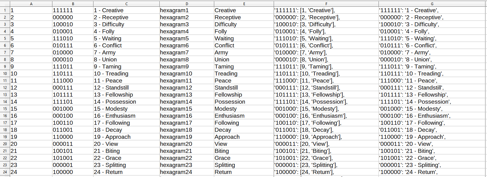

I took the last column of the previous spreadsheet and copied it into Python to create a dictionary of binary codes that correspond to a list containing the hexagram number and it's concept.

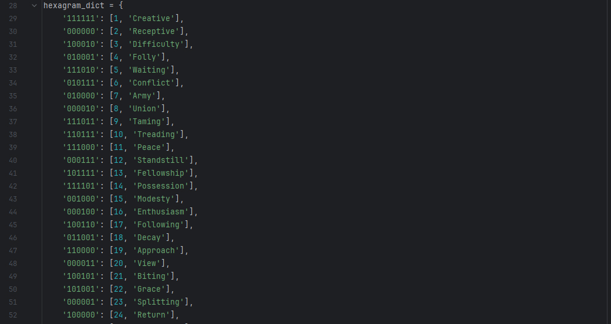

I created a JSON file that contains the interpretation of each of the 64 hexagrams. Each line of each of the 64 hexagrams has its own sub-meaning, which you can see recorded in the "lines" sections.

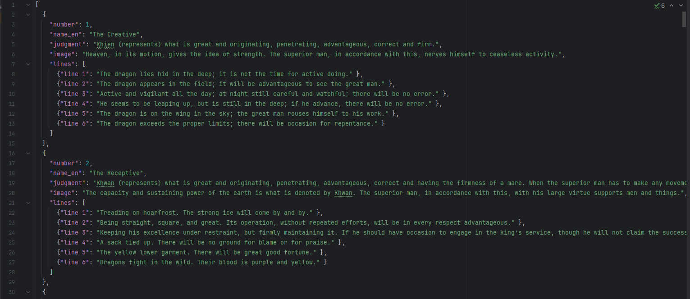

I created a class that casts a single line, which could be either yin or yang, changing or unchanging. These are stored as "polarity" and "movement".

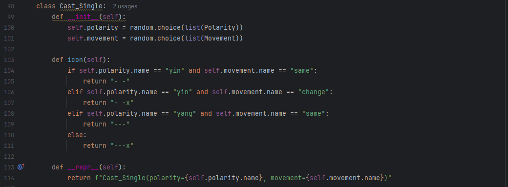

After creating a class to cast all six lines at once (not shown here; see source code for details), the next task is to figure which of the 6 lines to select as the sub-meaning of the full cast. You can see that if there are no changing lines, then you just read the original hexagram. If there is one changing line, consult the sub-meaning of that changing line. The rules for if there are two changing lines are somewhat complicated, etc.

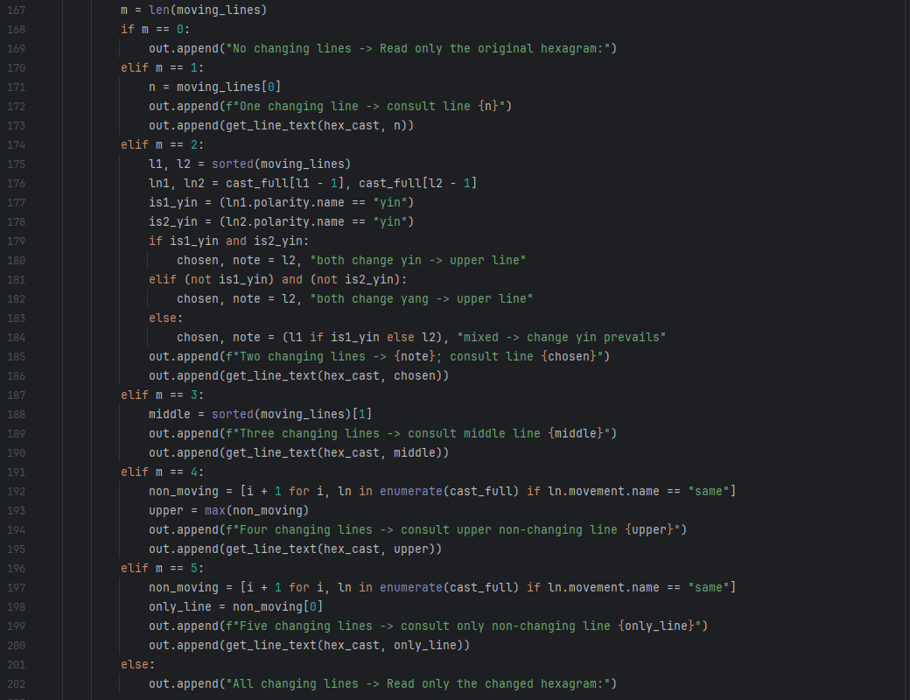

Here is another Python file that when run, asks us what our question of the IChing is, records the current date and time, then responds by calling the IChing class we just created, and records both the question and the response in a log file named, "IChing_log_main.txt"

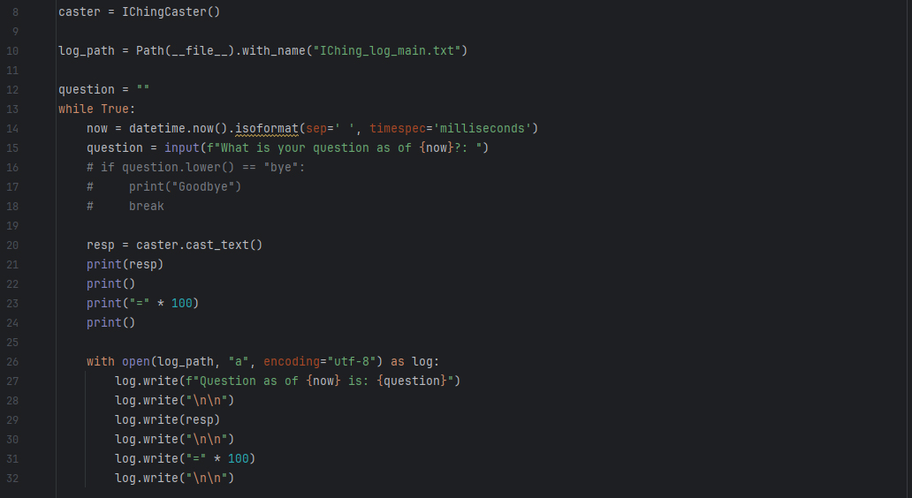

Here is a sample question and answer. I asked the IChing, "What is the meaning of life?" and it responded with the original hexagram "Before" (also translated as "Before Completion), transforming into the changed hexagram, "Progress." The only changing line was line 2, which gives the sub-meaning of, "He brakes his wheel. Perseverence brings good fortune."

A reasonable interpretation of this cast could be that the IChing is saying that the meaning of life is to make progress, be persevering, and not be in a hurry to "Cross the river" of life and make mistakes by "Getting his/her tail stuck in the water." Not bad for a 3000 year old book, right?

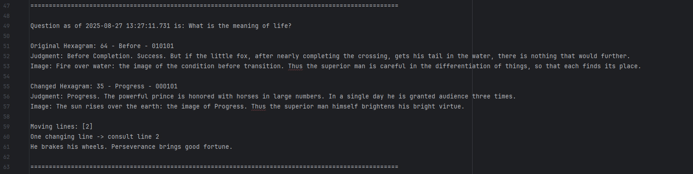

